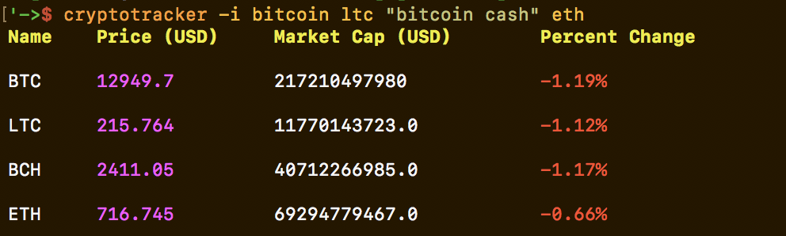
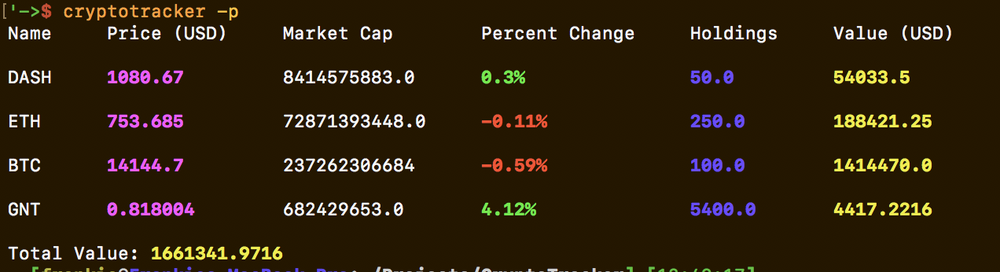

# CryptoTracker

An easy way to setup and manage your crypto currency portfolio from the terminal.

(Using the [Coin Market Cap](http://coinmarketcap.com/) API)

Compatible with Python 2 and Python 3

## Install

`python setup.py install`

## Usage

### View coin data

`cryptotracker -i bitcoin xrp dash`

### Convert fiat output

`cryptotracker -i bitcoin -c eur`

### Add to portfolio

`cryptotracker -a btc --amt 2000`

`cryptotracker --add ripple --amt 5352`

### Remove from portfolio

`cryptotracker -rm btc`

### View Portfolio

`cryptotracker -p`

## Screenshot

